# Развертывание IPsec Instance в Yandex Cloud

Оглавление:
* [Введение](#overview)
* [Сетевая топология развертывания](#topology)
* [Требования к облачным ресурсам](#resources)
* [Особенности развертывания](#notes)
* [Подготовка к развертыванию](#prep)
* [Развертывание IPsec Instance с помощью Web-UI](#web)
* [Развертывание IPsec Instance с помощью YC-CLI](#cli)
* [Развертывание IPsec Instance с помощью Terraform](#tf)


## Какую задачу решаем <a id="overview"/></a>

Развернуть `IPsec Instance` в формате одной виртуальной машины для организации сетевой IP-связности между ресурсами в `Yandex Cloud` и ресурсами на удаленной площадке.

Примечание: В данном развертывании резервирование (отказоустойчивость) `IPsec instance` не предусматривается.

## Сетевая Топология развертывания <a id="topology"/></a>

Типовая схема организации связи между Yandex Cloud и удаленной площадкой (на схеме обозначена как `Remote site`) представлена на схеме ниже.

<p align="left">
    
</p>

## Требования к облачным ресурсам <a id="resources"/></a>

Развертывание `IPsec instance` предполагается в уже существующей инфраструктуре Yandex Cloud. Перед началом развёртывания необходимо убедиться, что в вашей облачной инфраструктуре в Yandex Cloud уже созданы следующие ресурсы:
* [Облако](https://yandex.cloud/docs/resource-manager/operations/cloud/create)
* [Каталог облачных ресурсов](https://yandex.cloud/docs/resource-manager/operations/folder/create)
* Две **отдельных** [VPC сети](https://yandex.cloud/docs/vpc/operations/network-create) с [подсетями](https://yandex.cloud/docs/vpc/operations/subnet-create) для подключения внешнего (`outside`) и внутреннего (`inside`) сетевых интерфейсов IPsec instance. Совмещать `outside` и `inside` трафик на одном сетевом интерфейсе в данном развертывании не рекомендуется. На схеме сети VPC и их подсети обозначены следующим образом:
    * сеть `outside-net` с подсетью `outside-subnet`
    * сеть `inside-net` с подсетями `subnet-1`, `subnet-2` и `subnet-N`

В процессе развертывания `IPsec instance` в облачной инфраструктуре дополнительно будут созданы следующие ресурсы:
* [Статический публичный IP-адрес](https://yandex.cloud/docs/vpc/concepts/address#public-addresses) (на схеме `public-ip-1`), который будет использоваться для отправки в Интернет и получения из Интернет трафика сетевого интерфейса `outside` IPsec instance.
* [Группа безопасности](https://yandex.cloud/docs/vpc/concepts/security-groups) для сетевого интерфейса `outside` IPsec instance.
* [Виртуальная машина](https://yandex.cloud/docs/compute/concepts/vm) (на схеме `IPsec instance`) на базе решения [strongSwan](https://docs.strongswan.org/docs/5.9/index.html), которая будет обеспечивать работу IPsec соединения с удаленной площадкой, а также маршрутизацию сетевого трафика между ресурсами в Yandex Cloud и удаленной площадкой.
* [Таблица маршрутизации VPC](https://yandex.cloud/docs/vpc/concepts/routing#rt-vpc), которая обеспечивает маршрутизацию трафика в нужных подсетях в Yandex Cloud к подсетям на удаленной площадке через `IPsec instance`. На схеме обозначена как `ipsec-rt`.

## Особенности развертывания <a id="notes"/></a>

* ВМ с `IPsec instance` развертывается в одной из [зон доступности](https://yandex.cloud/docs/overview/concepts/geo-scope), на схеме `ru-central1-d`. Сетевые интерфейсы `inside` и `outside` подключаются к подсетям в той же зоне доступности (на схеме это `subnet-1` и `outside-subnet` соответственно).
* При создании ВМ необходимо добавить в неё `два сетевых интерфейса` в следующем порядке: для `outside` трафика (eth0) и `inside` трафика (eth1). 
* Передача параметров для настройки `IPsec instance` происходит с помощью [сервиса метаданных ВМ](https://yandex.cloud/docs/compute/concepts/metadata/sending-metadata). Список параметров зависит от выбранного инструмента развертывания (Web-UI, yc-CLI, Terraform).
* Для направления сетевого трафика к подсетям на удаленной площадке из отдельной подсети в Yandex Cloud, необходимо привязать таблицу маршрутизации `ipsec-rt` к этой подсети. В противном случае трафик в `IPsec instance` направляться не будет.

## Подготовка к развертыванию <a id="prep"/></a>

Перед выполнением развертывания необходимо определить его параметры:
* Название ВМ, например, `ipsec-instance`.
* Зону доступности, где будет развертываться ВМ, например, `ru-central1-d`.
* Названия подсетей для подключения сетевых интерфейсов ВМ `inside` и `outside`.
* Список подсетей, трафик из которых нужно будет маршрутизировать через `IPsec instance`.
* Название таблицы маршрутизации VPC с помощью которой трафик будет маршрутизироваться к `IPsec instance`.
* Кол-во ресурсов ВМ (CPU, RAM) для ВМ. В большинстве случаев будет достаточно `2 vCPU и 4GB RAM`.
* Образ для развертывания `ipsec-instance-ubuntu`.
* Название для группы безопасности `outside` интерфейса ВМ и состав правил в ней. Пример конфигурации группы безопасности в формате YC-CLI:
    ```bash
    yc vpc security-group create --name ipsec-outside-sg --network-name=outside-net \
    --rule "description=ipsec,direction=ingress,port=4500,protocol=udp,v4-cidrs=[0.0.0.0/0]" \
    --rule "description=ssh,direction=ingress,port=22,protocol=tcp,v4-cidrs=[0.0.0.0/0]" \
    --rule "description=icmp,direction=ingress,protocol=icmp,v4-cidrs=[0.0.0.0/0]" \
    --rule "description=permit-any,direction=egress,port=any,protocol=any,v4-cidrs=[0.0.0.0/0]"
    ```
* Блок параметров метаданных `ipsec` в формате YAML:
    ```yaml
    policy_name: yc-ipsec
    remote_ip: x.x.x.x
    preshared_key: Sup@385paS4
    local_subnets: 192.168.1.0/24,192.168.2.0/24,192.168.N.0/24
    remote_subnets: 10.10.11.0/24,10.10.12.0/24
    ike_proposal: aes128gcm16-prfsha256-ecp256
    esp_proposal: aes128gcm16
    r_timeout: 3.0
    r_tries: 3
    r_base: 1.0
    ```

    где,
    * `policy_name` -  название соединения IPsec в конфигурации strongSwan.
    * `remote_ip` - публичный IPv4 адрес IPsec шлюза удаленной площадки. На схеме обозначен как `public-ip-2`.
    * `preshared_key` - ключ шифрования для организации IPsec соединения. Должен быть одинаковым с обеих сторон соединения.
    * `local_subnets` - набор IPv4 префиксов подсетей со стороны Yandex Cloud, которые будут доступны через IPsec соединение удаленной площадке
    * `remote_subnets` - набор IPv4 префиксов подсетей со стороны удаленной площадки, которые будут доступны через IPsec соединение в Yandex Cloud
    * `ike_proposal` - [шифр для IKE proposal](https://docs.strongswan.org/docs/latest/config/proposals.html).
    * `esp_proposal` - [шифр для ESP proposal](https://docs.strongswan.org/docs/latest/config/proposals.html).
    * `r_timeout`, `r_tries`, `r_base` - параметры [Retransmission timeouts](https://docs.strongswan.org/docs/latest/config/retransmission.html) для IPsec соединения.


## Развертывание IPsec instance с помощью Web-UI <a id="web"/></a>

1. [Зарезервировать выделенный статический IP-адрес](https://yandex.cloud/docs/vpc/operations/get-static-ip#console_1), на схеме обозначен как `public-ip-1`.

2. [Создать группу безопасности для `outside` интерфейса ВМ](https://yandex.cloud/docs/vpc/operations/security-group-create). При создании группы безопасности необходимо добавить в неё правила, описанные в разделе [подготовка к развертыванию](#prep). При необходимости можно добавить в эту группу безопасности дополнительные правила.

3. [Создать таблицу маршрутизации VPC](https://yandex.cloud/docs/vpc/operations/static-route-create) с набором маршрутов (CIDR) подсетей на удаленной площадке и привязать ее к нужным подсетям в сети `inside-net`.

4. [Создать виртуальную машину](https://yandex.cloud/docs/compute/operations/vm-create/create-linux-vm#console_1), используя параметры, описанные в разделе [подготовка к развертыванию](#prep), например:
    * Образ загрузочного диска: `Marketplace -> IPsec инстанс`
    * Вычислительные ресурсы: `Standard -> 2 vCPU 4ГБ RAM`
    * Сетевые настройки:
        * Сетевой интерфейс №0 (eth0):
            * Подсеть: `outside-net/outside-subnet`
            * Публичный IP-адрес: `Список` -> выбрать из списка зарезервированный ранее публичный IP-адрес
            * Группы безопасности: выбрать из списка имя созданной ранее группы безопасности
            * раскрыть раздел "Дополнительно":
                * внутренний IPv4 адрес: `Список`
                * IP-адрес: `Зарезервировать`. Заполнить форму резервирования IP адреса, указав внутренний IP-адрес для `outside` интерфейса ВМ, например, `192.168.0.5`
        * Нажать на кнопку `Добавить сетевой интерфейс`.
        * Сетевой интерфейс №1 (eth1):
            * Подсеть: `inside-net/subnet-1`
            * Публичный IP-адрес: `Без адреса`
            * Группы безопасности: -
            * раскрыть раздел "Дополнительно":
                * внутренний IPv4 адрес: `Список`
                * IP-адрес: `Зарезервировать`. Заполнить форму резервирования IP адреса, указав внутренний IP-адрес для `inside` интерфейса ВМ, например, `192.168.1.5`
    * Доступ:
        * Логин: указать имя администратора ВМ, например, `oper`. Внимание! Имена `root` и `admin` использовать запрещено!
        * SSH-ключ: выбрать из списка уже существующий или загрузить новый публичный SSH-ключ для администратора ВМ.
    * Общая информация:
        * Имя ВМ: `ipsec-instance`
    * Раскрыть раздел `Метаданные`:
        * Ключ: `ipsec`
        * Значение:
            ```yaml
            policy_name: yc-ipsec
            remote_ip: <public-ip-2>
            preshared_key: Sup@385paS4
            local_subnets: 192.168.1.0/24,192.168.2.0/24,192.168.N.0/24
            remote_subnets: 10.10.11.0/24,10.10.12.0/24
            ike_proposal: aes128gcm16-prfsha256-ecp256
            esp_proposal: aes128gcm16
            r_timeout: 3.0
            r_tries: 3
            r_base: 1.0
            ```
    * Нажать на кнопку "Создать ВМ".

5. После создания ВМ, подключиться к ней по SSH, используя публичный IP-адрес, и запустить настройку `IPsec`:
```bash
ssh oper@<public-ip-1>
sudo -i
/usr/local/bin/ipsec-config.sh
```

6. Проверить сетевую связность между локальными ресурсами (на схеме это подсети с CIDR 192.168.x.0/24) и удаленными ресурсами (на схеме это подсети с CIDR 10.10.x.0/24).

7. В случае отсутствия сетевой связности между локальными и удаленными ресурсами необходимо провести диагностику состояния `IPsec` соединения: 
```bash
ssh oper@<public-ip-1>
sudo -i
swanctl -l
swanctl -L
swanctl --log
```

## Развертывание IPsec instance с помощью YC-CLI <a id="cli"/></a>

1. Заполнить значения параметров развертывания в файле [ipsec-cli-deploy.sh](./ipsec-cli-deploy.sh)
2. Подготовить окружение:
    ```bash
    source env-yc.sh
    terraform init
    ```
3. Выполнить развертывание `IPsec instance`:
    ```bash
    ./ipsec-cli-deploy.sh
    ```
4. Привязать созданную таблицу маршрутизации VPC (на схеме обозначена как `ipsec-rt`) к нужным подсетям в сети `inside-net`.
5. Проверить сетевую связность между локальными ресурсами (на схеме это подсети с CIDR 192.168.x.0/24) и удаленными ресурсами (на схеме это подсети с CIDR 10.10.x.0/24).

6. В случае отсутствия сетевой связности между локальными и удаленными ресурсами необходимо подключиться к ВМ по SSH и провести диагностику состояния IPsec соединения: 
```bash
ssh oper@<public-ip-1>
sudo -i
swanctl -l
swanctl -L
swanctl --log
```


## Развертывание IPsec instance с помощью Terraform <a id="tf"/></a>

1. Заполнить значения параметров развертывания в файле [terraform.tfvars](./terraform.tfvars)
2. Подготовить окружение:
    ```bash
    source env-yc.sh
    terraform init
    ```
3. Выполнить развертывание `IPsec instance`:
    ```bash
    terraform apply
    ```
4. Привязать созданную таблицу маршрутизации VPC (на схеме обозначена как `ipsec-rt`) к нужным подсетям в сети `inside-net`.
5. Проверить сетевую связность между локальными ресурсами (на схеме это подсети с CIDR 192.168.x.0/24) и удаленными ресурсами (на схеме это подсети с CIDR 10.10.x.0/24).

6. В случае отсутствия сетевой связности между локальными и удаленными ресурсами необходимо подключиться к ВМ по SSH и провести диагностику состояния IPsec соединения: 
```bash
ssh oper@<public-ip-1>
sudo -i
swanctl -l
swanctl -L
swanctl --log
```
